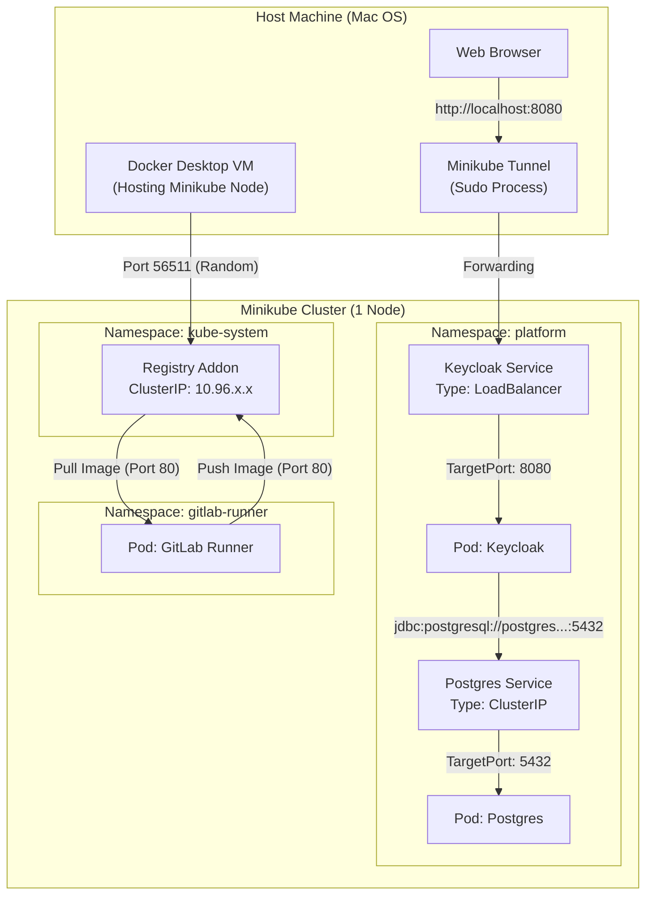

# Network Architecture & Connectivity

This document details the network flow, port mappings, and connectivity paths for the Local Platform Lab.

## High-Level Topology



## detailed Port Mappings

### 1. Platform Services (User Facing)

| Service | Access Method | Host Port | Internal Service Port | Target Container Port | Notes |
| :--- | :--- | :--- | :--- | :--- | :--- |
| **Keycloak** | `minikube tunnel` | `8080` (localhost) | `8080` | `8080` | Accessed via typical web browser. Requires tunnel running. |
| **Postgres** | `kubectl port-forward` | Varies (Manual) | `5432` | `5432` | Not exposed by default. Use port-forward or `psql` inside cluster. |

### 2. Infrastructure Services (Internal)

| Service | Host Access | Internal Cluster Address | Internal Port | Notes |
| :--- | :--- | :--- | :--- | :--- |
| **Registry** | `localhost:56511`* | `registry.kube-system.svc.cluster.local` | `80` | *Host port is dynamic/assigned by Docker driver. Check with `minikube addons open registry --url`. |
| **Runner** | None | N/A | N/A | Outbound only (polls GitLab.com). |

## Connection Strings for Applications

If you are deploying an application into the cluster (e.g., in `default` namespace), use these Internal DNS names:

**Database (JDBC/Postgres):**
```
jdbc:postgresql://postgres.platform.svc.cluster.local:5432/appdb
```

**Identity (OIDC Issuer):**
```
http://keycloak.platform.svc.cluster.local:8080/realms/<your-realm>
```
*Note: If testing via Browser redirect, you may need to configure the Frontend URL in Keycloak to be `http://localhost:8080`.*

**Registry (Image Pull):**
```
image: registry.kube-system.svc.cluster.local/my-group/my-image:tag
```
