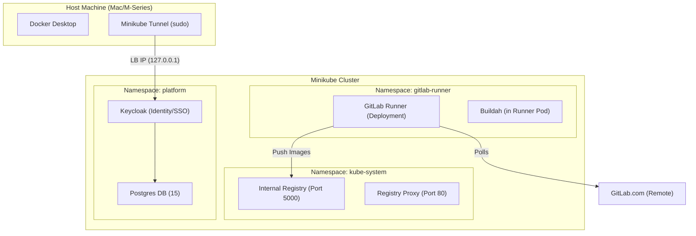

# Platform Context & Architecture

## Overview
This **Local Platform Lab** simulates a robust, enterprise-grade generic platform environment running entirely on your local machine via Minikube. It provides the core services required for application teams to build, deploy, and run modern cloud-native applications.

## Architecture

## Core Components

| Component | Type | Version | Purpose |
| :--- | :--- | :--- | :--- |
| **Minikube** | Infrastructure | Latest | Local Kubernetes Cluster (Docker Driver). |
| **GitLab Runner** | CI/CD | Latest | Executes CI pipelines locally using Kubernetes executors. |
| **Buildah** | CI Tool | Stable | Daemonless OCI image builder (embedded in Runner jobs). |
| **Minikube Registry** | Artifacts | 2.x | Local insecure registry for storing built images (`registry.kube-system.svc.cluster.local`). |
| **Keycloak** | Identity | 24.x | OIDC/SAML Provider for Apps. Accessible at `http://127.0.0.1:8080`. |
| **Postgres** | Database | 15-alpine | Shared Relational DB for Keycloak and Apps. |

## Service Connection Details

These credentials are pre-configured for the **Lab Environment**. Do not use in production.

### 1. Identity Provider (Keycloak)
*   **External URL**: `http://127.0.0.1:8080` (Requires `minikube tunnel`)
*   **Internal K8s URL**: `http://keycloak.platform.svc.cluster.local:8080`
*   **Admin Console**: `/admin/`
*   **Credentials**:
    *   User: `admin`
    *   Password: `admin`

### 2. Database (PostgreSQL)
*   **Internal Host**: `postgres.platform.svc.cluster.local` (Port 5432)
*   **Superuser**: `postgres` / `lab-password`
*   **Application DB**:
    *   DB Name: `appdb`
    *   User: `appuser`
    *   Password: `apppassword`

### 3. Container Registry
*   **Push Host (Inside CI)**: `registry.kube-system.svc.cluster.local`
*   **Pull Host (Inside K8s)**: `localhost:5000` or `registry.kube-system.svc.cluster.local`
*   **Credentials**: None (Anonymous/Insecure)
*   **Web Access**: None (Headless)

## Workflow for App Teams

1.  **Develop**: specific application code.
2.  **Define Pipeline**: Use the provided `ci-templates/buildah-build-template.yml`.
3.  **Build**: Connect Repository to the local GitLab Runner. The pipeline builds the image using Buildah.
4.  **Push**: Image is pushed to the internal Minikube registry.
5.  **Deploy**: Helm/Manifests deploy the app to Minikube, pulling the image from the local registry, connecting to `postgres.platform` for data, and identifying via `keycloak.platform`.
